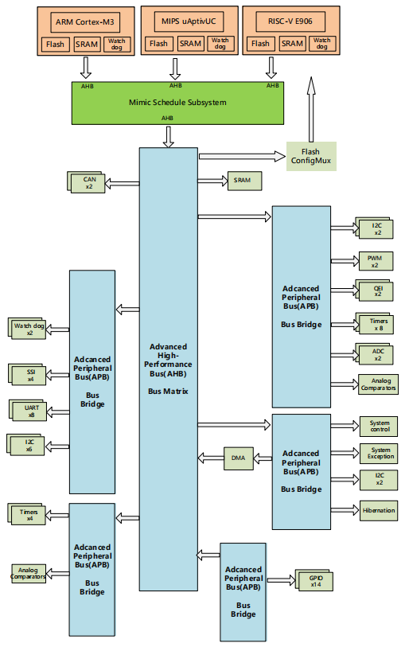

# ESC0830
Everything about ESC0830 chip.
## What's ESC0830
The ESC0830 Endogenous Security Controller Chip is a microcontroller based on ARM Cortex-M3/MIPS microAptiv UC/RISC-V T-Head E906 tri-core heterogeneous redundant CPU cores, designed for embedded applications that demand high integration and low power consumption. 

Featuring multiple heterogeneous microprocessor cores and a mimicry scheduler, it enables mimicry adjudication with multi-level redundancy capabilities.
## How to Start
For those new to the ESC0830, we recommend the following learning path:

1.Start with ESC0830 Demo Guide Manual.pdf for environment setup, compilation, flashing, and running examples.

2.Watch ESC0830 Demo Tutorial Video.mp4 for a visual walkthrough of the development workflow.

3.Refer to ESC0830 Chip User Manual.pdf for details on chip pins, system design, and peripherals.

4.Explore the development board user manuals and other documentation as needed.
## Language
We are currently preparing English versions of the documentation and will share them as soon as they are available. In the meantime, please feel free to reach out if you have any questions or need further assistance.
## Contact
We welcome contributions and discussions on our Github page.

If you really need technical support, please contact the corresponding person based on the type of issue: for hardware-related issues, please email wushuping@pmlabs.com.cn; for software-related issues, please email hujingjing@pmlabs.com.cn. When sending an email, kindly cc liyu@pmlabs.com.cn and caihanzhi@pmlabs.com.cn.
## Thanks
Happy exploring, and we hope you enjoy the security design experience with ESC0830!

Best regards,

Endogenous Safety and Security Center Chip Team,

Purple Mountain Laboratories
